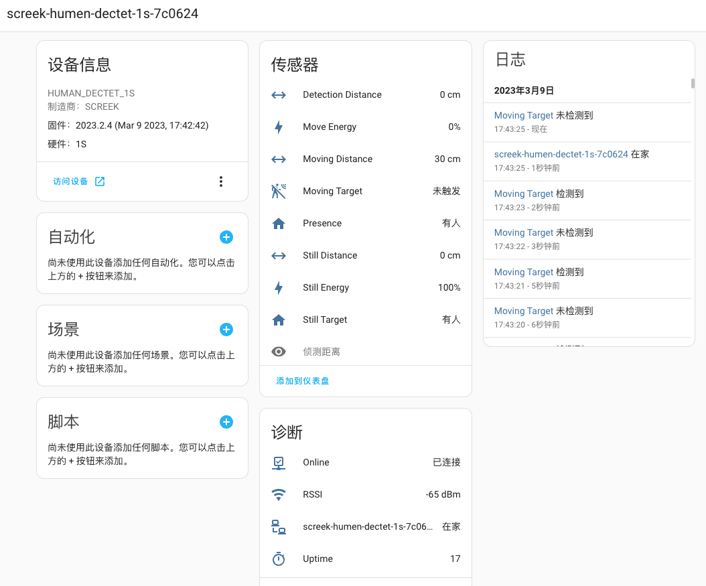
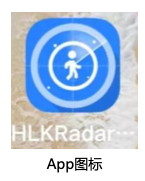

与HA结合完善的雷达传感器，能够让你的自动化加入雷达的能力，感应到人体进行互动操作。  

## 产品特色
- 支持蓝牙调节参数。
- 高效率WIFI连接优化。
- 基于ESPHome，能够快速连接到HA系统中。  

## HA界面

## 调参软件
雷达供应商的官方工具`HLKRadarTools`可以使用蓝牙协议直接雷达来调节各种参数：
> 目前APP支持安卓和IOS平台，可以到这个链接下载:https://www.pgyer.com/Lq8p(安卓) 也可以去各大应用商店搜索“HLKRadarTools”并安装。
> 

## 其它
陆续添加中...